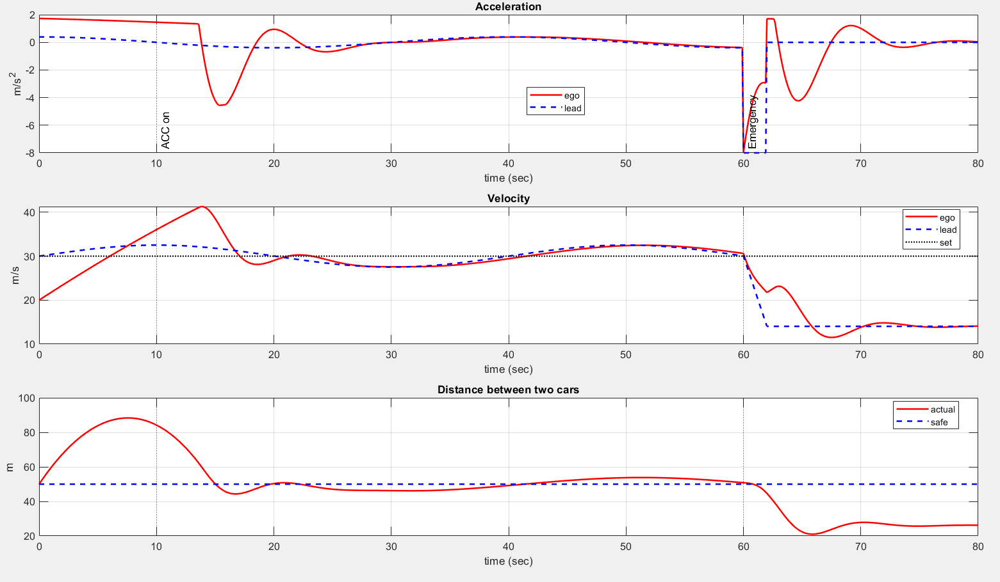
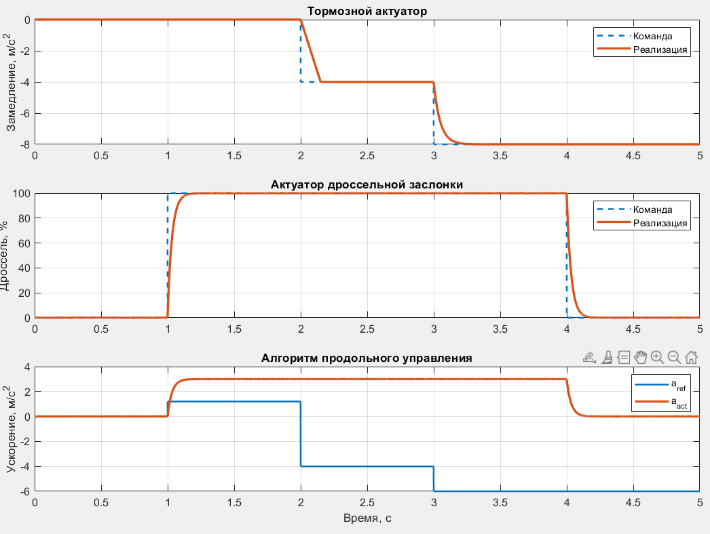
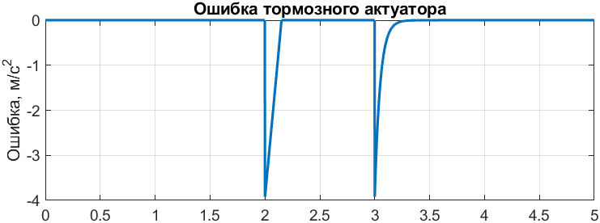
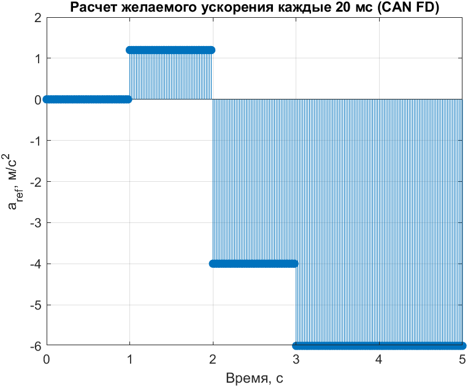
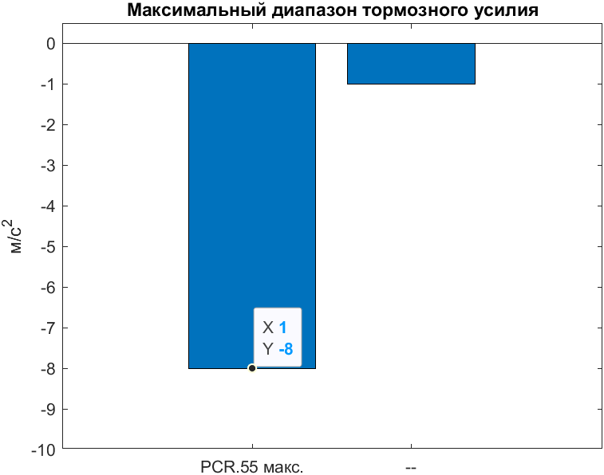
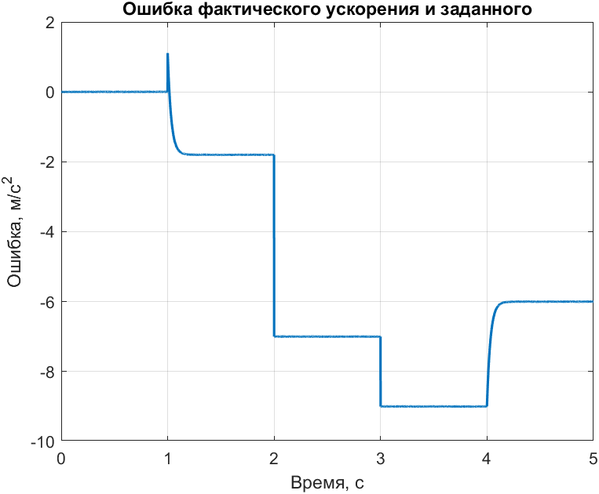

# Моделирование продольной динамики автомобиля

## Общее описание
Эта программа на MATLAB моделирует продольную динамику транспортного средства на основе фундаментальных физических уравнений. Модель включает расчет сил в шинах, аэродинамического сопротивления, сил трения качения и распределения веса.

## Основные функции
- Реализация полной системы уравнений продольной динамики
- Моделирование режимов разгона и торможения
- Учет аэродинамического сопротивления и трения качения
- Расчет распределения нормальных сил по осям
- Визуализация ключевых параметров движения

## Настройка параметров
В основном блоке программы можно изменить:
- Массу автомобиля (`params.m`)
- Аэродинамические характеристики (`Cd`, `Af`)
- Параметры колес (`reff`, `Cqf`, `Cqr`)
- Начальные условия (`x0`, `v0`)
- Время моделирования (`tspan`)

## Выходные данные
Программа генерирует три графика:
1. Скорость (км/ч) от времени
2. Силы в передних и задних шинах от времени
3. Положение автомобиля от времени

## Примечания
- По умолчанию моделируется движение по инерции (без крутящего момента)
- Для моделирования разгона/торможения измените параметры `Tf` и `Tr`
- Угол наклона дороги регулируется параметром `theta`

# Моделирование работы системы Адаптивного круз-контроля с экстренной ситуацией

# Моделирование работы исполнительных механизмов системы ACC

